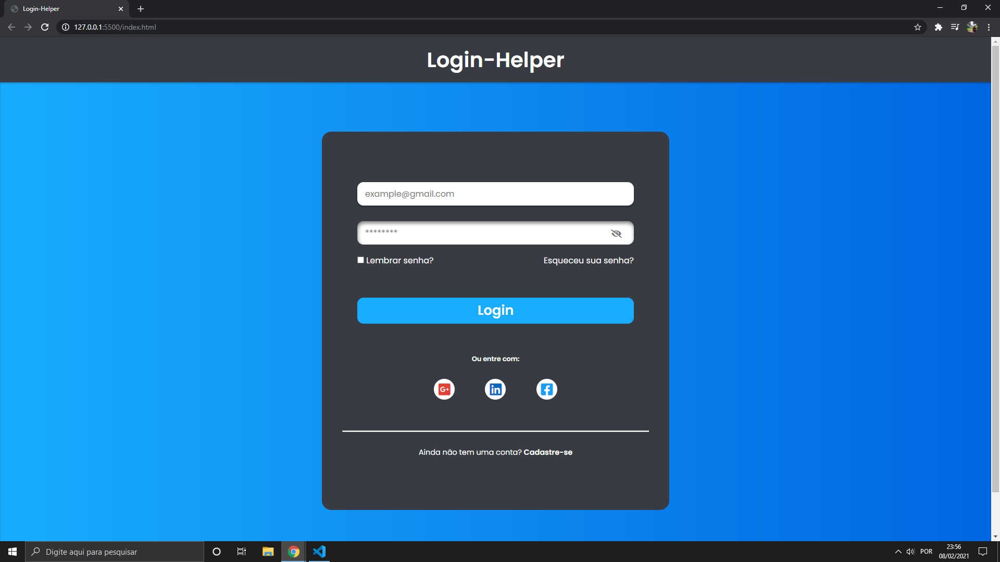
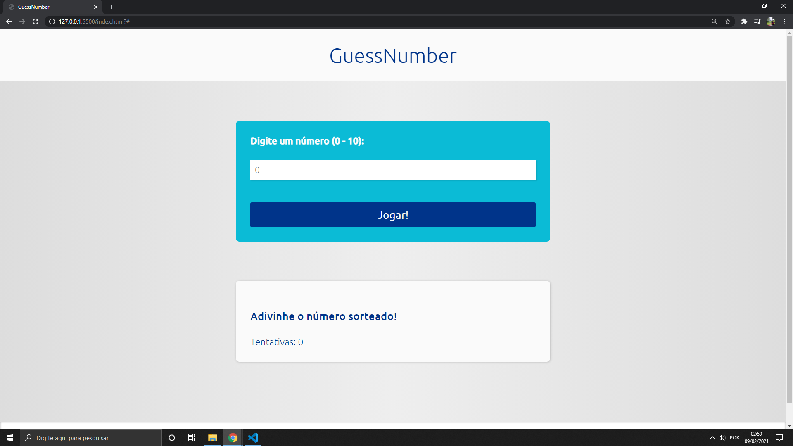
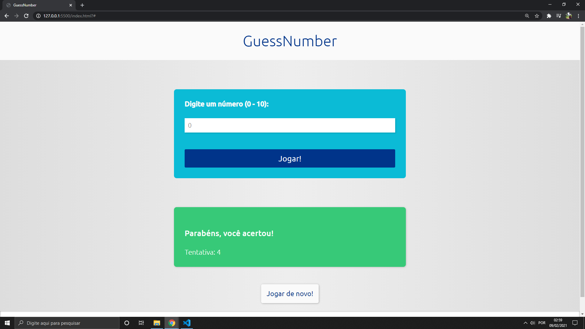
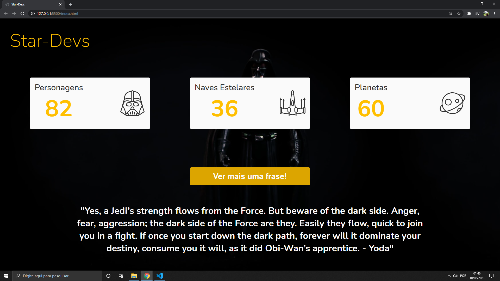

# HTML5-CSS3-e-Javascript-course
Repositório dedicado a um curso prático de html5, css3 e Javascript

## Login

-------------------------------------------------------------##---------------------------------------------------------------

## GuessNumber
1

2

-------------------------------------------------------------##---------------------------------------------------------------

## Stardevs

